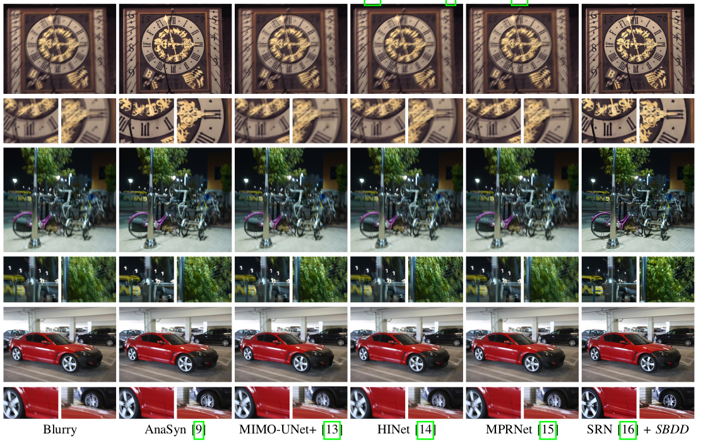
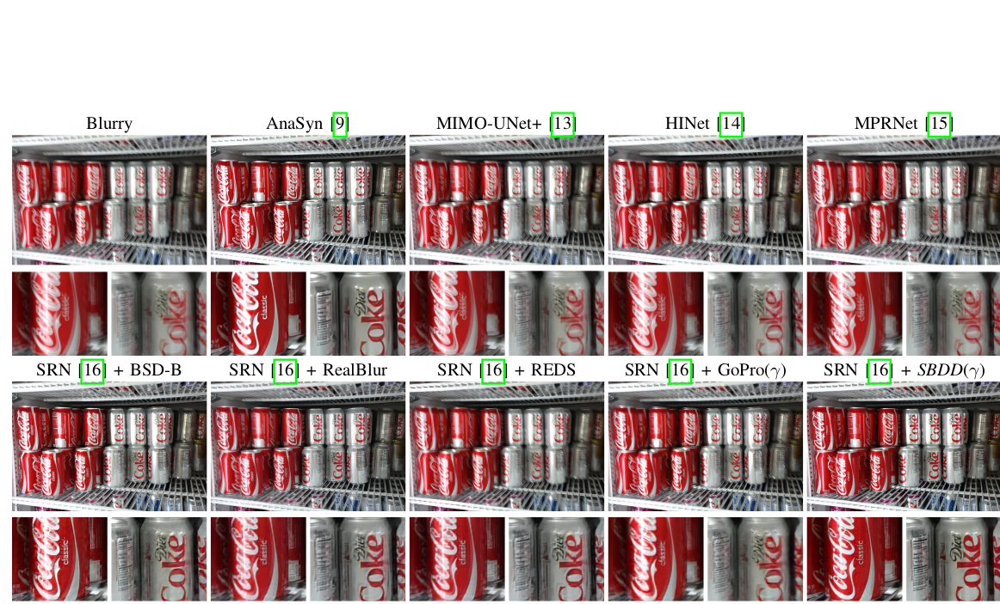
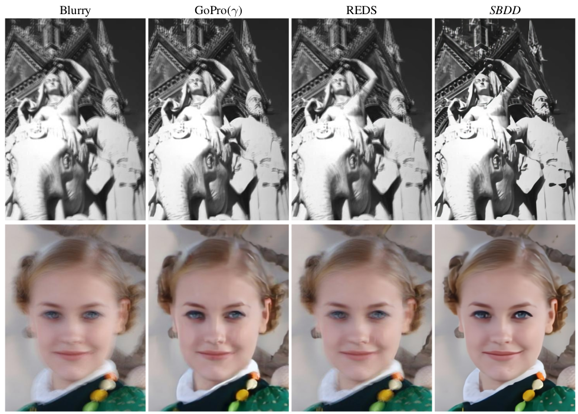

# Improving Generalization of Deep Motion Deblurring Networks: A Convolution-Based Procedure for Analyzing and Addressing the Limitations of Current Benchmark Datasets
G Carbajal, P Vitoria, P Musé, J Lezama


> Successfully training end-to-end deep networks for real motion deblurring requires datasets of sharp/blurred image pairs that are realistic and diverse enough to achieve generalization to real blurred images. Obtaining such datasets remains a challenging task. In this paper, we first review the limitations of existing deblurring benchmark datasets from the perspective of generalization to blurry images in the wild and analyze the underlying causes. 
Secondly, based on this analysis, we propose an efficient procedural methodology to generate sharp/blurred image pairs based on a simple yet effective model for forming blurred images. This allows for generating virtually unlimited realistic and diverse training pairs. We demonstrate the effectiveness of the proposed dataset by training existing deblurring architectures on the simulated pairs and performing cross-dataset evaluation on four standard datasets of real blurred images. When training with the proposed method, we observed superior generalization performance for the ultimate task of deblurring real motion-blurred photos of dynamic scenes.

State-of-the-art deblurring neural networks achieve spectacular restorations in the GoPro dataset, but generalize poorly to real non-uniformly blurred images (as shown in the figure below).            
   

## Trained models

[SRN](https://github.com/jiangsutx/SRN-Deblur), [DeepDeblur](https://github.com/SeungjunNah/DeepDeblur-PyTorch), [MIMO-UNet+](https://github.com/chosj95/MIMO-UNet), and [NAFNet](https://github.com/megvii-research/NAFNet) models trained with the proposed Segmentation Based Deblurring Dataset (SBDD) can be downloaded from below. We also provide links to models trained with other datasets to facilitate the comparison.   

| Arch \ Dataset |   GoPro |  REDS  |  SBDD  |          
|-------|:---------------------|:--------------------|---------------------|         
| SRN   | [public model](https://iie.fing.edu.uy/~carbajal/SBDD_data/SBDD_models/srn-models/GoPro_color.zip) | [trained](https://iie.fing.edu.uy/~carbajal/SBDD_data/SBDD_models/srn-models/REDS_color.zip) | [trained](https://iie.fing.edu.uy/~carbajal/SBDD_data/SBDD_models/srn-models/SRN_SBDD_models.zip) |    
| DeepDeblur |[public model](https://drive.google.com/file/d/1AfZhyUXEA8_UdZco9EdtpWjTBAb8BbWv/view?usp=sharing)| [public model](https://drive.google.com/file/d/1UwFNXnGBz2rCBxhvq2gKt9Uhj5FeEsa4/view?usp=sharing) | [trained](https://iie.fing.edu.uy/~carbajal/SBDD_data/SBDD_models/deep-deblur-models/SBDD_gamma.zip) |
| MIMO-UNet+ |[public model](https://drive.google.com/file/d/166sufeHcdDTgXHNbCRzTC4T6DzuflB5m/view?usp=sharing)|  | [trained](https://iie.fing.edu.uy/~carbajal/SBDD_data/SBDD_models/MIMO_UNet+_SBDD_models.zip) |   
| NAFNet|[public model](https://github.com/megvii-research/NAFNet/blob/main/docs/GoPro.md)| [public model](https://github.com/megvii-research/NAFNet/blob/main/docs/REDS.md) | [trained](https://iie.fing.edu.uy/~carbajal/SBDD_data/SBDD_models/NAFNet_SBDD_models.zip) |      

## Testing SRN Models

### 1. Conda environment and requirements
```
conda create -n srn-py27 python=2.7
conda activate srn-py27
pip install scipy scikit-image numpy tensorflow-gpu==1.12
conda install cudnn==7.6.5
```

### 2. Test the model

```
cd SRN-Model
python run_model.py --input_path=../sample_images --output_path=../sample_results --training_dir model_folder --step iteration_number

# Example
# python run_model.py --input_path=../sample_images --output_path=../sample_results --training_dir  /media/carbajal/OS/data/models/srn_models/SRN_SBDD_models/GoPro_uniform_ks65_texp05_F1000_ill_aug_2up_n10_ef5 --step 262800
```

   


## Testing DeepDeblur Models

Please clone the DeepDeblur [repository](https://github.com/SeungjunNah/DeepDeblur-PyTorch) and follow the installation instructions. Then run:

```
python main.py --save_dir SAVE_DIR --demo true --demo_input_dir INPUT_DIR_NAME --demo_output_dir OUTPUT_DIR_NAME
# SAVE_DIR is the experiment directory where the parameters are saved (GOPRO_L1, REDS_L1 or the provided [SBDD_gamma]())
# SAVE_DIR is relative to DeepDeblur-PyTorch/experiment
# demo_output_dir is by default SAVE_DIR/results
# image dataloader looks into DEMO_INPUT_DIR, recursively
```

  

## Dataset Generation

To generate a dataset with the proposed methodology you can follow the following steps:

### 1. Conda environment and requirements

conda create -n SBDD python=3.8     
pip install -r requirements.txt    

### 2.GoPro dataset, segmentation masks and kernels datasets

Download the GoPro dataset, the segmentation masks, and the kernels used to generate the dataset:

[GOPRO_LARGE_FOLDER](https://seungjunnah.github.io/Datasets/gopro.html)                
[SEGMENTATION_INFO_FOLDER](https://iie.fing.edu.uy/~carbajal/SBDD_data/GoPro_detectron2_segmentation.zip)      
[kernels_SBDD](https://iie.fing.edu.uy/~carbajal/SBDD_data/ks65_texp05_F1000_kernels.zip)

### 3. Generation

Unzip the previous file and then replace the following lines in the script dataset/generate_dataset.sh by your *<GOPRO_LARGE_FOLDER>*, *<SEGMENTATION_INFO_FOLDER>* and *<KERNELS_FOLDER>*. 

GOPRO_LARGE_FOLDER='/media/carbajal/OS/data/datasets/GOPRO_Large/original-data'
SEGMENTATION_INFO_FOLDER='/media/carbajal/OS/data/datasets/GoPro_detectron2_segmentation'     
KERNELS_FOLDER='/media/carbajal/OS/data/datasets/kernel_dataset/ks65_texp05_F1000/train'        

Then, run:

```
cd datasets
bash generate_dataset.sh
```

## Sample Dataset 

An instance of our dataset generation procedure can can be downloaded from [here](https://iie.fing.edu.uy/~carbajal/SBDD_data/SBDD_NU_ill_aug_2up_gf22_n10.zip). It was generated with non uniform blur, asuming a gamma correction factor of 2.2, and multiplicative augmentation. The parameter used to generate de dataset can be found inside the dataset folder. 

## Models Evaluation


When ground-truth blurry-sharp pairs are available (GoPro, DVD, REDS, RealBlur) we used the following code to quantify the restoration quality. We adapted the evaluation code from [RealBlur](https://github.com/rimchang/RealBlur)  repository.

```
cd evaluation
python evaluation_parallel_ecc.py -b datasets/RealBlur/test/blur -s datasets/RealBlur/test/gt -r resultsRealBlur/RealBlur_with_SBDD
```

For Kohler dataset, we used: 

```
python evaluation_Kohler_parallel_ecc.py -b datasets/KohlerDataset/BlurryImages -s datasets/KohlerDataset/GroundTruthImg -r results_Kohler/Kohler_with_SBDD
```


## Reference 
```
@article{carbajal2022rethinking,
  title={Rethinking Motion Deblurring Training: A Segmentation-Based Method for Simulating Non-Uniform Motion Blurred Images},
  author={Carbajal, Guillermo and Vitoria, Patricia and Mus{\'e}, Pablo and Lezama, Jos{\'e}},
  journal={arXiv preprint arXiv:2209.12675},
  year={2022}
}
```

