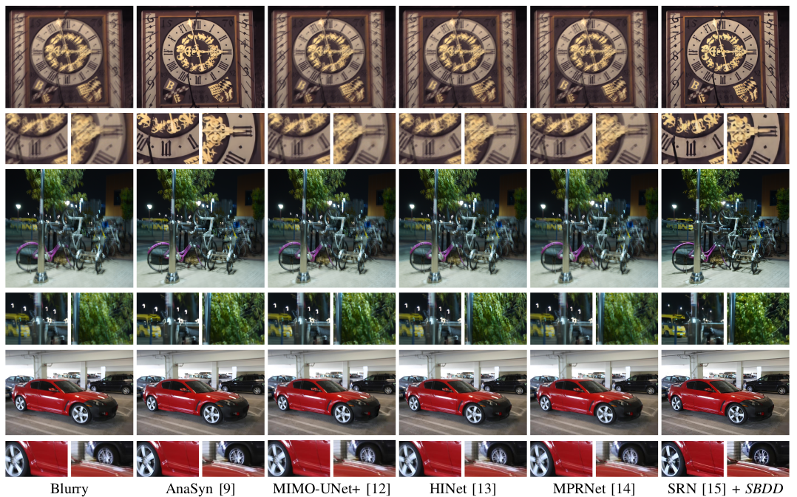

# Rethinking Motion Deblurring Training: A Segmentation-Based Method for Simulating Non-Uniform Motion Blurred Images

|  |

## Trained models

[SRN](https://github.com/jiangsutx/SRN-Deblur) and [DeepDeblur](https://github.com/SeungjunNah/DeepDeblur-PyTorch) models trained with SBDD and also other datasets can be downloaded from below.  

| Arch \ Dataset |   GoPro |  REDS  |   SBDD-gamma  | SBDD  |          
|-------|:---------------------|:--------------------|---------------------|-------------|         
| SRN   | [provided](https://iie.fing.edu.uy/~carbajal/SBDD_models/srn-models/GoPro_color.zip) | [trained](https://iie.fing.edu.uy/~carbajal/SBDD_models/srn-models/REDS_color.zip) | [trained](https://iie.fing.edu.uy/~carbajal/SBDD_models/srn-models/SRN-SBDD_gamma.zip) | [trained](https://iie.fing.edu.uy/~carbajal/SBDD_models/srn-models/SRN-SBDD.zip)  |    
| DeepDeblur |[provided](https://drive.google.com/file/d/1AfZhyUXEA8_UdZco9EdtpWjTBAb8BbWv/view?usp=sharing)| [provided](https://drive.google.com/file/d/1UwFNXnGBz2rCBxhvq2gKt9Uhj5FeEsa4/view?usp=sharing) | [trained](https://iie.fing.edu.uy/~carbajal/SBDD_models/deep-deblur-models/DeepDeblur-SBDD_gamma/model-200.pt)  |    |      

## SBDD Dataset 

The dataset used to train the models (with gamma correction) can be downloaded from [here](https://iie.fing.edu.uy/~carbajal/SBDD/SBDD_gamma.zip)

## Testing SRN Models

### 1. Conda environment and requirements
```
conda create -n srn-py27 python=2.7
conda activate srn-py27
pip install scipy scikit-image numpy tensorflow-gpu==1.12
conda install cudnn==7.6.5
```

### 2. Test the model

```
cd SRN-Model
python run_model.py --input_path=../sample_images --output_path=../sample_results --training_dir model_folder --step iteration_number

# Example
# python run_model.py --input_path=../sample_images --output_path=../sample_results --training_dir  /media/carbajal/OS/data/models//srn_models/COCO10k_mob2_ADENew_aug_25k --step 673800
```

## Dataset Generation

To generate a dataset with the proposed methodology you can follow the following steps:

### 1. Conda environment and requirements

conda create -n SBDD python=3.8     
pip install -r dataset/requirements.txt    

### 2.COCO, ADE20K and kernels datasets

Download COCO, ADE20K and the kernels used to generate the dataset:

[COCO (2017 train images)](https://cocodataset.org/#download)       
[ADE20K](https://groups.csail.mit.edu/vision/datasets/ADE20K/)                
[kernels_SBDD](https://iie.fing.edu.uy/~carbajal/SBDD/kernelsSBDD.zip)

### 3. Generation

Replace the following lines in the script dataset/generate_dataset.sh by your COCO, ADE20K and kernels folder.

ADE_DIR='/media/carbajal/OS/data/datasets/ADE20K_new/carbajal_776b3c5f'     
ADE_INDEX='/media/carbajal/OS/data/datasets/ADE20K_new/carbajal_776b3c5f/ADE20K_2021_17_01/index_ade20k.pkl'      
COCO_DIR='/media/carbajal/OS/data/datasets/COCO/images/train2017'       
KERNELS_DIR='/media/carbajal/OS/data/datasets/kernel_dataset'        

Then, run:

```
cd dataset
bash generate_dataset.sh
```

## Models Evaluation


When ground-truth blurry-sharp pairs are available (GoPro, DVD, REDS, RealBlur) we used the following code to quantify the restoration quality. We adapted the evaluation code from [RealBlur](https://github.com/rimchang/RealBlur)  repository.

```
cd evaluation
python evaluation_parallel_ecc.py -b datasets/RealBlur/test/blur -s datasets/RealBlur/test/gt -r resultsRealBlur/RealBlur_with_SBDD
```

For Kohler dataset, we used: 

```
python evaluation_Kohler_parallel_ecc.py -b datasets/KohlerDataset/BlurryImages -s datasets/KohlerDataset/GroundTruthImg -r results_Kohler/Kohler_with_SBDD
```
